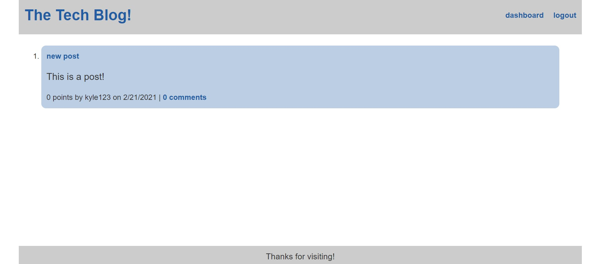

# The Tech Blog!

## Description:

This is a full stack application where you can create and interact with blog posts. You also need to create an account to do so. It was made using node and express for the server. Mysql, sequelize for the database. Sessions, dotenv, bcrypt for most everything else, and it also uses handlebars for a template engine.
Application live at https://cryptic-forest-92421.herokuapp.com/

## Example of site homepage.

## Questions:

Please direct any questions to Frankenshtien on GitHub or email barber.von.frankenshtien@gmail.com.
